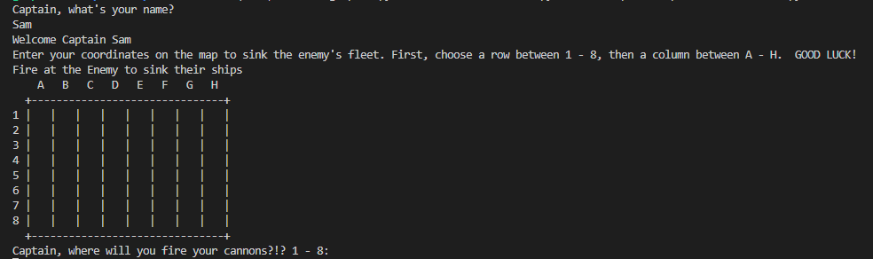
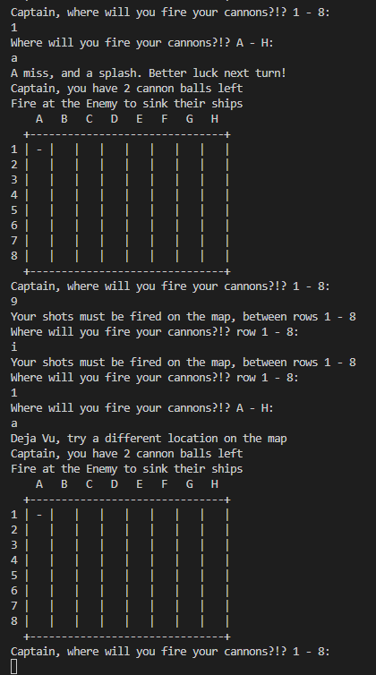
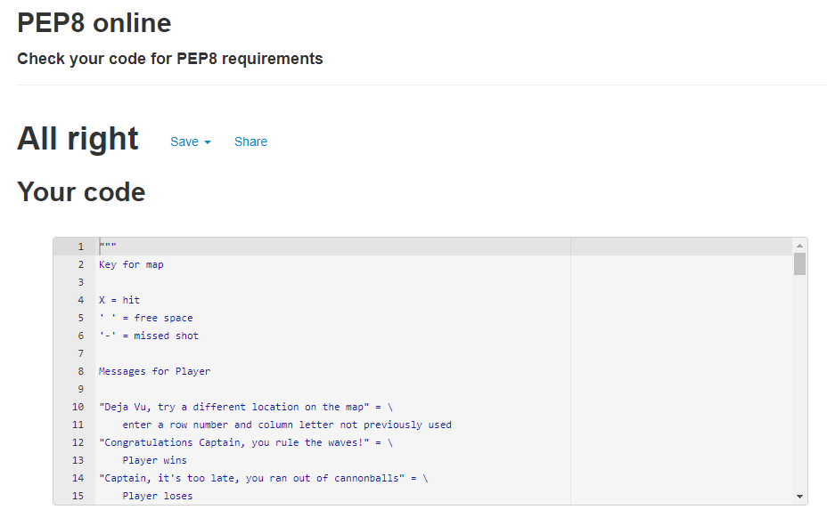
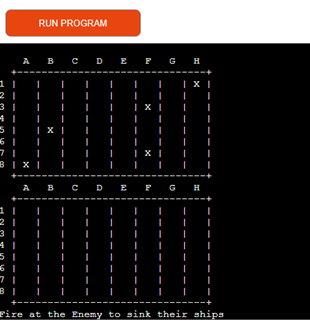
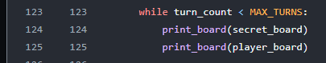
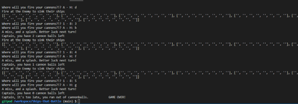

# **Ships that Battle**

For my third Portfolio Project submitted as part of the Code Institute's Diploma in full-stack software development course, I created a board game, commonly known as battleship, called ' Ships that Battle'. This is a Python terminal that runs using the Code Institute mock terminal on Heroku.   

- **[Click Here]( https://ships-that-battle.herokuapp.com/)** to see the deployed website. 

- To view the repository on Github **[Click Here](https://github.com/SamOBrienOlinger/Ships-that-Battle)**.

## **Summary**
  This interactive game provides users with an easy way to 'fire cannonballs' at a computer ‘enemy’s fleet of ships’. The game is based on the well-known board game ‘Battleship’, to learn more about this game **[Click Here]( https://en.wikipedia.org/wiki/Battleship_game)**.

## **[Contents](#contents)**

1.	**[How to Play](#how-to-play)**
2.	**[Features](#features)**
3.	**[Features Left to Implement](#features-left-to-implement)**
4.	**[Data Model](#data-model)**
5.	**[Testing](#testing)**
6.	**[Bugs](#bugs)**
7.	**[Deployment](#deployment)**
8.	**[Credits](#credits)**
9.	**[Acknowledgements](#acknowledgements)** 

## **[How to Play](#how-to-play)**

In this version of the classic Battleship game, the player enters their name and an empty board is displayed. Five randomly located ships are generated which the player cannot see. 

The player must guess the coordinates of the hidden ships by choosing a row number and a column letter. The player has ten ‘cannonballs’ or turns to take in order to ‘hit’ the hidden ships. 

Hits are indicted by ‘X’ and misses ‘-‘

If the player hits all of the computer’s ships they win the game. If they fire all of their cannonballs and fail to do so, they lose the game.  

## **[Features](#features)**

### Existing features
* Random board generation
  * Ships are randomly placed on the board by the computer so that the player cannot see where they are.

  

* Accepts player’s input.

* Validates coordinates input by player.

* Tells player if they input invalid values or the same values more than once.

* Tells player how many turns or 'cannon balls' they have left.

  

### Featuers left to implement

 * HTML and CSS is required to enhance UX
 * An option for the User to decide on the size of the game board and how many ships

## **[Data Model](#data-model)**

-	Functions are used on throughout the code to avoid repetitive code as much as possible.

-	Methods are used throughout the game to print and/or return instructions and responses to the player’s input of name and the coordinates for the player to advance in the game and win or lose. 

-	The randint()Method was imported to generate the ships at various locations on the game board.  

-	The special built-in Python variable __name__ is used to execute the main module directly.  

## **[Testing](#testing)**

PEP8 Online was used to validate the Python code to ensure there were no errors present, such as issues with indentation or whitespaces. 

## **[Bugs](#bugs)**

Two bugs were encountered in developing this project:

-	The computer’s board with the random location of the ships was being printed for the player to see. This defeats the object of the game and had to be fixed. 

This was happening for testing purposes to make sure that the player could win and/or lose. This bug was fixed by removing Line 124.

-	Another initial bug was that the board was not printing out correctly.

The simple fix for the board bug was proper indentation on Line 62 (board[ship_row][ship_column] = 'X').

‘Bugged’ code: 

~~~
def random_ship_location(board):
    '''
    Places 5 ships at random on given board
    '''
    for ship in range(5):
        ship_row, ship_column = randint(0, 7), randint(0, 7)
        while board[ship_row][ship_column] == 'X':
            ship_row, ship_column = randint(0, 7), randint(0, 7)
    board[ship_row][ship_column] = 'X'

~~~

debugged code:

~~~
def initialize_board(board, max_ships):
    """
    Places `max_ships` ships at random on given board.
    """
    for _ in range(max_ships):
        ship_row, ship_column = randint(0, 7), randint(0, 7)
        while board[ship_row][ship_column] == "X":
            ship_row, ship_column = randint(0, 7), randint(0, 7)

        board[ship_row][ship_column] = "X"
~~~

##	**[Deployment](#deployment)**

**Heroku**

The project was deployed using Code Institute's mock terminal for Heroku.

Steps for deployment:

1.	Fork or clone this repository.
2.	Create a new Heroku app.
3.	Set the buildbacks to python and NodeJS in that order.
4.	Link the Heroku app to the repository.
5.	Click on Deploy.

##	**[Credits](#credits)**

The following online resources were used for a range of supports such as getting correct syntax and learning more about functions and generating random coordinates for the ships:

•	Code Institute LMS, in particular the [Portfolio Project Scope]( https://learn.codeinstitute.net/courses/course-v1:CodeInstitute+PE_PAGPPF+2021_Q2/courseware/b3378fc1159e43e3b70916fdefdfae51/605f34e006594dc4ae19f5e60ec75e2e/)

•	[W3Schools]( https://www.w3schools.com/)

•	[Stack Overflow](https://stackoverflow.com/)

•	[MDN Web Docs](https://developer.mozilla.org/en-US/)

•	[Geeks for Geeks](https://www.geeksforgeeks.org/)

Code used to develop the game board was based on battleship code developed by [Garrett Broughton]( https://github.com/gbrough/battleship): 

~~~
  def get_letters_to_numbers():
    letters_to_numbers = {"A": 0, "B": 1, "C": 2, "D": 3, "E": 4, "F": 5, "G": 6, "H": 7}
    return letters_to_numbers

  def print_board(self):
      print("  1 2 3 4 5 6 7 8")
      print("  A B C D E F G H")
      print("  +-+-+-+-+-+-+-+")
      row_number = 1
      for row in self.board:
          print("%d|%s|" % (row_number, "|".join(row)))
          row_number += 1

~~~

##	**[Acknowledgements](#acknowledgements)** 

- A number of YouTube explainer videos were really helpful:

  - [5 - Python Indentation]( https://www.youtube.com/watch?v=Cd-k6QQMa18)
  - [How to Make A Simple Game in Python (For Beginners)]( https://www.youtube.com/watch?v=BDi3SD7E6no)
  - [How to code battle ship game board in python]( https://www.youtube.com/watch?v=cwpS_ac8uk0)
  - [Learn Python with CodeCademy: Battleship!]( https://www.youtube.com/watch?v=7Ki_2gr0rsE&list=PL8yQOxsW917EWx8Vxcoko3_swX-lmg2G1&index=1)
  - [How to Code Battleship in Python - Single Player Game]( https://www.youtube.com/watch?v=tF1WRCrd_HQ&list=PL8yQOxsW917EWx8Vxcoko3_swX-lmg2G1&index=1)
  - [Deploy your first App with Heroku and Node.js]( https://www.youtube.com/watch?v=MxfxiR8TVNU)

   - My mentor, [Sandeep Aggarwal](https://code-institute-room.slack.com/archives/D02TFLJRZTR), was a great support and he provided key feedback which helped deliver this project.  
   
   - A number of Code Institute Tutors and students were very supportive via slack and the Student Support Live Chat. The following tutors and students helped guide me and to tease out a range of issues I faced developing the project: 
     
      - [jo_ci]( https://github.com/wings30306)
      - [AlexaHendry_5P]( https://code-institute-room.slack.com/team/U02FQKWTXGT)
      - [oisin_ci]( https://code-institute-room.slack.com/archives/D03NCBKR8BB)
      - [gemma_ci]( https://code-institute-room.slack.com/archives/D03MT4GMGG6)
      - [alexandru_ci]( https://code-institute-room.slack.com/archives/D03MK4WD9NK)

**[Click Here](#contents)** to return to Contents

